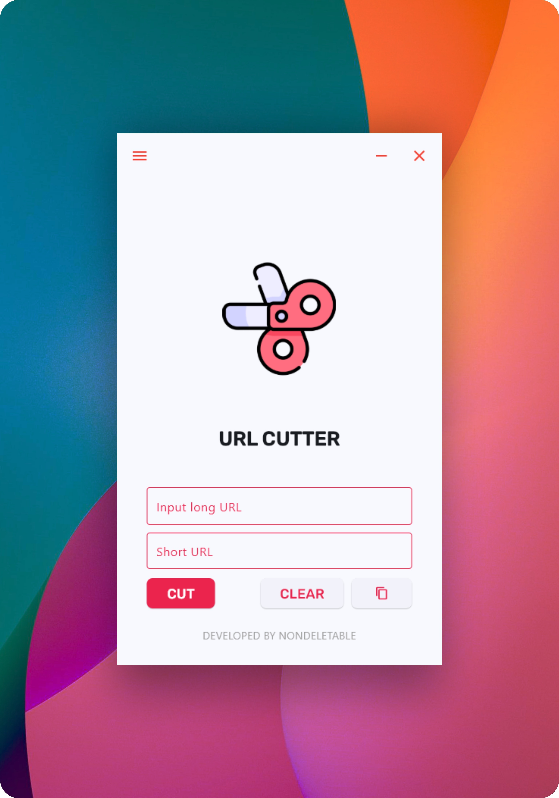

# URL Cutter

A convenient desktop application for shortening long URLs, built with Python and Flet.

---

## 🚀 Features

- Input a long URL and instantly get a shortened version.
- Uses `pyshorteners` (TinyURL) as the shortening backend.
- Copy shortened links directly to the clipboard.
- Clear input fields with a single click.
- **New in v1.2.4:**
  - History window with table view of shortened links.
  - Search and filtering by URL, service, or date.
  - Customizable table columns.
- Responsive and minimalist interface.

---

## 🛠 Technologies

- Python
- Flet (for GUI)
- pyshorteners (for URL shortening)
- SQLAlchemy + Alembic (for history storage and migrations)

---

## 📸 Screenshots

---

## Download

Download the latest Windows build (.exe) from [Releases](https://github.com/nondeletable/URL-Cutter/releases) page.

---

## 📫 Contacts

* **Telegram:** [@nondeletable](https://t.me/nondeletable)
* **Email:** [nondeletable@gmail.com](mailto:nondeletable@gmail.com)

✨ Thank you for using URL Cutter! We hope it makes your workflow faster and easier.
