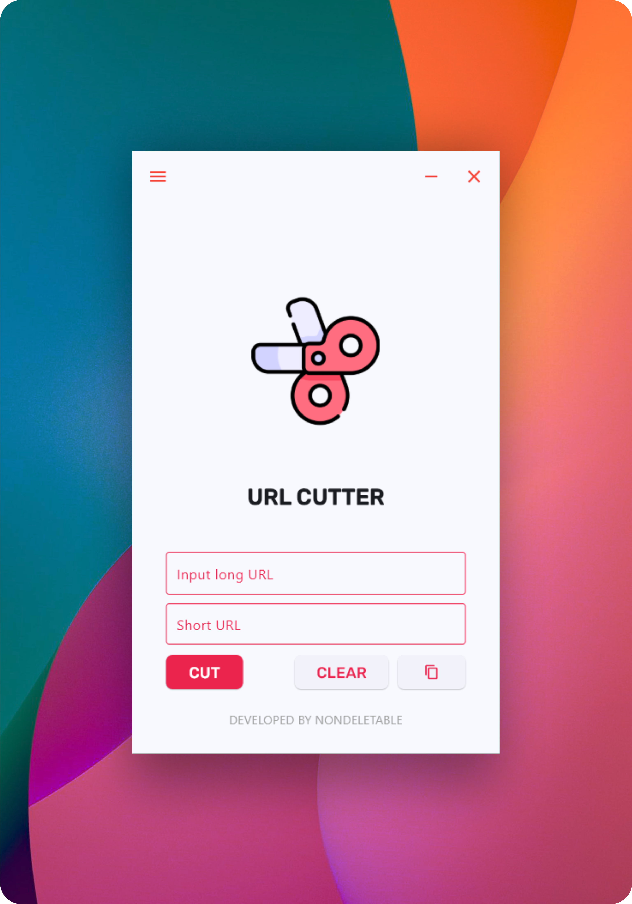

  
<h2>URL Cutter</h2>

Eine schlanke Desktop-App zum Kürzen langer Links und zum übersichtlichen Verwalten – mit Verlauf, Suche und schneller Kopierfunktion.

  

	<a href="https://github.com/nondeletable/URL-Cutter/tree/master/README/README-UC-EN.md">English </a> |
    <a href="https://github.com/nondeletable/URL-Cutter/blob/master/README/README-UC-DE.md">Deutsch </a> |
    <a href="https://github.com/nondeletable/URL-Cutter/blob/master/README/README-UC-CN.md">简体中文 </a> |
    <a href="https://github.com/nondeletable/URL-Cutter/blob/master/README/README-UC-VN.md">Tiếng Việt </a> |
    <a href="https://github.com/nondeletable/URL-Cutter/blob/master/README/README-UC-RU.md">Русский </a>
     
     
    
     
     
  

## 🔗 Was diese App macht

- Wandelt lange Links mit nur wenigen Klicks in kurze um.
- Kopiert die gekürzte URL mit einem einzigen Button-Klick.
- Speichert einen durchsuchbaren Verlauf aller erstellten Links (damit nichts verloren geht).
- Filter nach URL / Service / Datum sowie anpassbare Tabellenspalten.
- Ideal zum Teilen von Links in Chats, sozialen Netzwerken, Dokumenten oder Kommentaren.
&nbsp;
&nbsp;

## 🎨 Funktionen

- Sofortiges Kürzen langer URLs.
- Nutzung von TinyURL über `pyshorteners`.
- Ein-Klick-Kopieren in die Zwischenablage.
- Verlaufsfenster (Tabellenansicht).
- Reaktionsschnelle und minimalistische Oberfläche.
&nbsp;
&nbsp;

## 😎 Datenschutz & Sicherheit

- ✅ Keine Konten, keine Analysen, keine Telemetrie.
- ✅ Der Verlauf wird lokal auf deinem Rechner gespeichert (SQLite über SQLAlchemy).
- ⚠️ Zum Kürzen eines Links wird die URL an den TinyURL-Dienst gesendet (so funktioniert der Kürzungsprozess).
&nbsp;
&nbsp;

## ⚒ Installation

- Gehe zu **Releases** und lade die neueste ".exe" herunter.
- Entpacke die Dateien an einen beliebigen Ort (Desktop, Tools-Ordner, USB-Stick).
- Starte "URL Cutter.exe".
&nbsp;
&nbsp;

## 🏓 Verwendung

1. Lange URL einfügen.
2. Auf **CUT** klicken.
3. Auf das **Copy**-Symbol klicken, um den Kurzlink zu kopieren.
4. **History** öffnen, um Links später zu suchen, zu filtern und erneut zu verwenden.

  

&nbsp;
&nbsp;

## 💾 Technologien

- Python 3.13
- Flet (UI)
- pyshorteners (TinyURL)
- SQLAlchemy + Alembic (Verlaufsspeicherung & Migrationen)
- pytest + coverage (Tests)
- ruff, black, pre-commit (Code-Qualität)
- PyInstaller (Windows-Builds)
&nbsp;
&nbsp;

## Qualität

- Testabdeckung: **90%**
- Releases: **3** (Gesamtversionen: **7**)
- Größe des Windows-Builds: ~**87 MB**
&nbsp;
&nbsp;

## ☎ Support & Kontakte

Wenn du zusammenarbeiten möchtest oder über eine Job-Möglichkeit sprechen willst, nutze gern einen der Kontakte unten.
Für Support oder Bug-Reports bitte Discord oder GitHub Issues verwenden. Ich antworte in der Regel innerhalb von 24 Stunden.

- 🐙 **GitHub** page – Dokumentation, Releases, Quellcode
  https://github.com/nondeletable
- 💬 **Discord** – Neuigkeiten, Support, Fragen und Bug-Reports
  https://discord.com/invite/6nvXwXp78u
- ✈️ **Telegram** – Direktnachrichten
  https://t.me/nondeletable
- 📧 **Email** – für formelle oder geschäftliche Anfragen
  nondeletable@gmail.com
- 💼 **LinkedIn** – professionelles Profil
  https://www.linkedin.com/in/aleksandra-gicheva-3b0264341/
- ☕ **Boosty** – Unterstützung meiner Arbeit und Projekte durch Spenden
  https://boosty.to/codebird/donate
&nbsp;
&nbsp;

**Vielen Dank, dass du URL Cutter verwendest!**
Mögen deine Links kurz sein – und deine Tage lang und voller Freude! 🔗✨🙂
